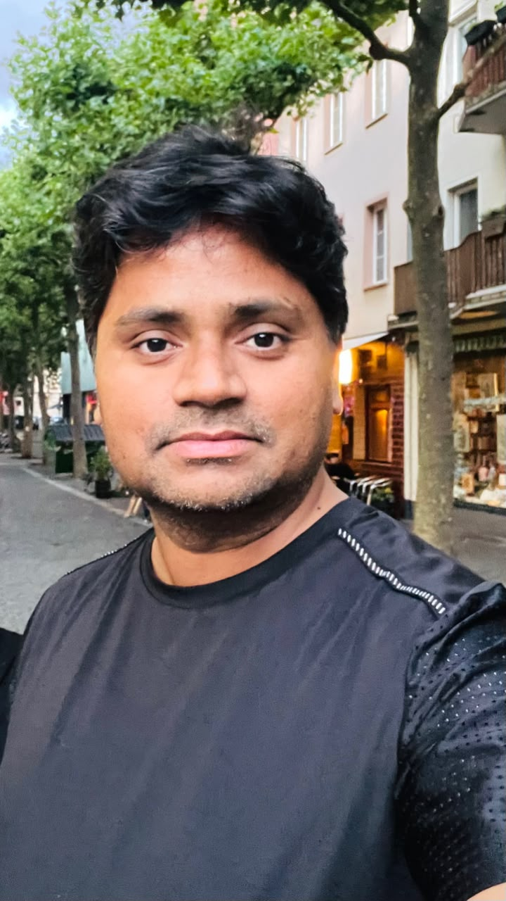

<!-- ========================================================= -->
<!-- HERO SECTION                                               -->
<!-- ========================================================= -->

::: {.hero}

::: {.columns}

:::: {.column width="60%"}

# Amandeep Singh

## Building next-generation quantum sensing platforms through solid-state spin defects, advanced instrumentation, and scientific software.

**Experimental Quantum Physicist**

Postdoctoral Fellow  
Institute of Applied Physics  
The Hebrew University of Jerusalem

[Research](pages/research.qmd){.btn .btn-primary}
[Projects](pages/projects.qmd){.btn .btn-outline-primary}
[Publications](pages/publications.qmd){.btn .btn-outline-primary}
[Software](pages/software.qmd){.btn .btn-outline-primary}
[CV](pages/cv.qmd){.btn .btn-outline-primary}

::::

:::: {.column width="35%"}

{fig-alt="Amandeep Singh" width="50%"}

::::

:::

:::

---

# Research Vision

I am an experimental quantum physicist developing next-generation quantum sensing technologies based on solid-state spin defects. My research combines **quantum sensing**, **quantum magnetic imaging**, **precision instrumentation**, **quantum control**, **scientific software**, and **nanofabrication** to create experimental platforms for quantum science and emerging quantum technologies.

My long-term goal is to develop scalable quantum sensing systems capable of enabling high-sensitivity magnetic imaging, precision metrology, and real-world applications in physics, materials science, and the life sciences.

---

# Research Highlights

::: {.grid}

::: {.g-col-12 .g-col-md-6 .g-col-lg-4}

::: {.card}

### Quantum Sensing

- Diamond NV Centers
- Quantum Magnetometry
- Precision Quantum Sensors
- Spin Defect Physics

[Explore →](pages/research.qmd)

:::

:::

::: {.g-col-12 .g-col-md-6 .g-col-lg-4}

::: {.card}

### Quantum Magnetic Imaging

- Widefield ODMR
- Microwave-Free Imaging
- Event Camera Imaging
- Lock-in Imaging

[Explore →](pages/research.qmd)

:::

:::

::: {.g-col-12 .g-col-md-6 .g-col-lg-4}

::: {.card}

### Quantum Control

- Quantum Machines OPX
- Pulse Engineering
- Microwave Control
- Experimental Automation

[Explore →](pages/research.qmd)

:::

:::

::: {.g-col-12 .g-col-md-6 .g-col-lg-6}

::: {.card}

### Scientific Software

- NV Control Framework
- Python Development
- Hardware Integration
- Open Source

[Explore →](pages/software.qmd)

:::

:::

::: {.g-col-12 .g-col-md-6 .g-col-lg-6}

::: {.card}

### Nanofabrication

- Diamond Device Fabrication
- Microfabrication
- Materials Characterization
- Quantum Device Engineering

[Explore →](pages/research.qmd)

:::

:::

:::

---

# Featured Projects

::: {.grid}

::: {.g-col-12 .g-col-lg-4}

::: {.card}

### NV Control Framework

A modular Python framework for controlling diamond NV center experiments, integrating hardware drivers, experiment logic, graphical interfaces, and data acquisition into a scalable architecture.

**Status:** 🟢 Active Development

[Explore Project →](pages/projects.qmd)

:::

:::

::: {.g-col-12 .g-col-lg-4}

::: {.card}

### Microwave-Free Quantum Magnetic Imaging

Developing microwave-free quantum magnetic imaging using high-density diamond NV ensembles for robust and scalable sensing.

**Status:** 🟢 Active Research

[Explore Project →](pages/projects.qmd)

:::

:::

::: {.g-col-12 .g-col-lg-4}

::: {.card}

### Event Camera Quantum Imaging

Developing high-speed quantum magnetic imaging using neuromorphic event-based cameras for ultrafast magnetic field measurements.

**Status:** 🟢 Active Research

[Explore Project →](pages/projects.qmd)

:::

:::

:::
---

# Selected Publications

*A curated selection of representative publications will appear here.*

[View All Publications →](pages/publications.qmd)

---

# Get in Touch

If you are interested in collaboration, scientific discussions, open-source software, or quantum sensing research, please feel free to get in touch.

[Contact →](pages/contact.qmd)