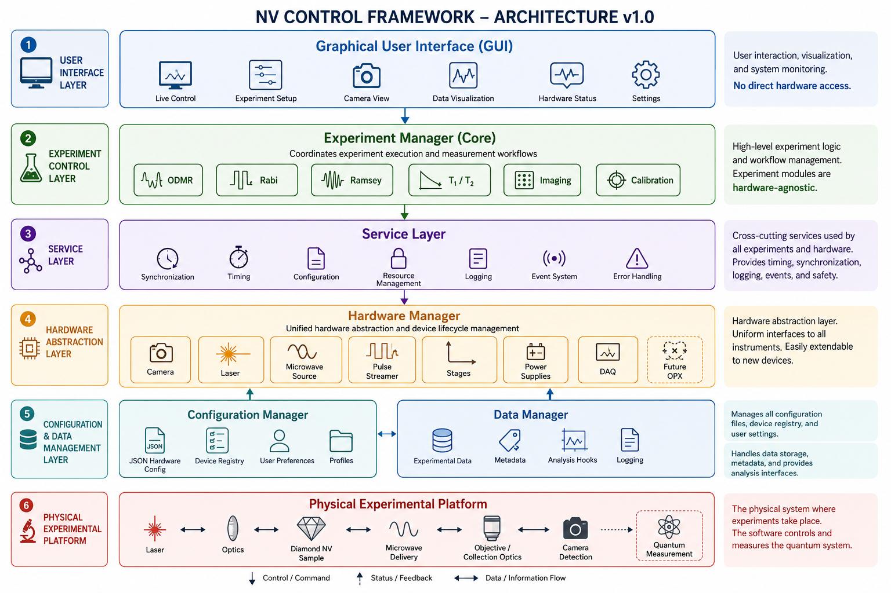

# Software Architecture

The NV Control Framework follows a modular layered architecture that separates user interaction, experiment logic, system services, hardware abstraction, configuration management, and the physical experimental platform.

{width=100%}

*Figure 1. NV Control Framework Architecture v1.0.*

## Design Principles

- Separation of concerns
- Hardware abstraction
- Configuration-driven initialization
- Modular experiment classes
- Extensible architecture

## Core Components

| Component | Responsibility |
|-----------|----------------|
| GUI | User interaction |
| Experiment Manager | Experiment orchestration |
| Service Layer | Timing, logging, synchronization |
| Hardware Manager | Hardware abstraction |
| Configuration Manager | JSON configuration |
| Data Manager | Data storage and metadata |

## Related Documentation

- [Hardware](hardware.qmd)
- [Experiments](experiments.qmd)
- [Roadmap](roadmap.qmd)